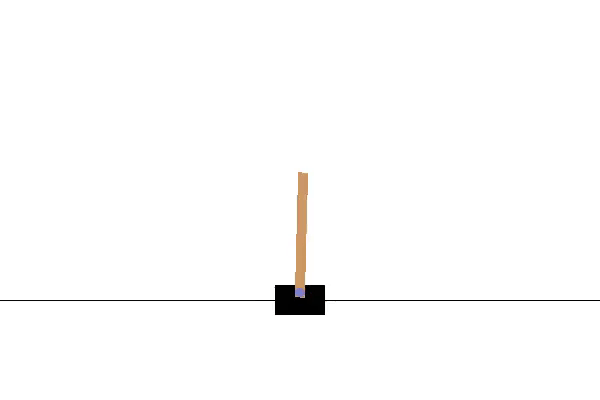
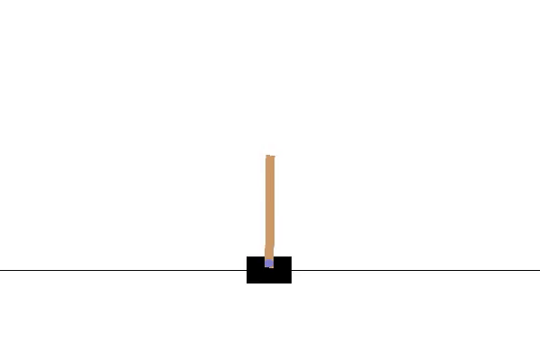

This is a series of projects where I solve RL environments by building RL algorithms from scratch using Python, Pytorch and Tensorflow

# Cart Pole
## Environment:
    This environment corresponds to the version of the cart-pole problem described by Barto, Sutton, and Anderson in ["Neuronlike Adaptive Elements That Can Solve Difficult Learning Control Problem"]( https://ieeexplore.ieee.org/document/6313077 ).
    A pole is attached by an un-actuated joint to a cart, which moves along a frictionless track. The pendulum starts upright, and the goal is to prevent it from falling over by increasing and reducing the cart's velocity.  

Unlearned model (Fails as soon as it moves to the right)

  

Learned model (Balances the pole for 199 timesteps, after which the environment ends)

## Source code for environment:
https://github.com/openai/gym/blob/master/gym/envs/classic_control/cartpole.py
## States Space:
    The observation is a `ndarray` with shape `(4,)` where the elements correspond to the following:

    | Num | Observation           | Min                  | Max                |
    |-----|-----------------------|----------------------|--------------------|
    | 0   | Cart Position         | -4.8*                | 4.8*               |
    | 1   | Cart Velocity         | -Inf                 | Inf                |
    | 2   | Pole Angle            | ~ -0.418 rad (-24°)**| ~ 0.418 rad (24°)**|
    | 3   | Pole Angular Velocity | -Inf                 | Inf                |

#### Note: 
The table denotes the ranges of possible observations for each element, but in two cases this range exceeds the range of possible values in an un-terminated episode:
 *: the cart x-position can be observed between (-4.8, 4.8), but an episode terminates if the cart leaves the (-2.4, 2.4) range.
** : Similarly, the pole angle can be observed between (-.418, .418) radians or precisely ±24°, but an episode is terminated if the pole angle is outside the (-.2095, .2095) range or precisely ±12°
Starting State
All observations are assigned a uniform random value between (-0.05, 0.05)
Episode Termination
The episode terminates of one of the following occurs:

    1. Pole Angle is more than ±12°
    2. Cart Position is more than ±2.4 (center of the cart reaches the edge of the display)
    3. Episode length is greater than 500 (200 for v0)

## Rewards:
    Reward is 1 for every step taken, including the termination step. The threshold is 475 for v1.
## Action Space:
    The agent  takes a 1-element vector for actions. The action space is (action) in [0, 1], where `action` is used to push the cart with a fixed amount of force:
Num	Action
0	Push cart to the left  
1	Push cart to the right
	
Note: The amount the velocity is reduced or increased is not fixed as it depends on the angle the pole is pointing. This is because the centre of gravity of the pole increases the amount of energy needed to move the cart underneath it
## Approach:
This exercise was undertaken to explore the Policy gradient methodology that is best suited for continuous action spaces and for identifying stochastic policies. I used the REINFORCE method that uses completes a full episode (Monte Carlo updates) before running the state features through a one-layer Fully connected layer. 
